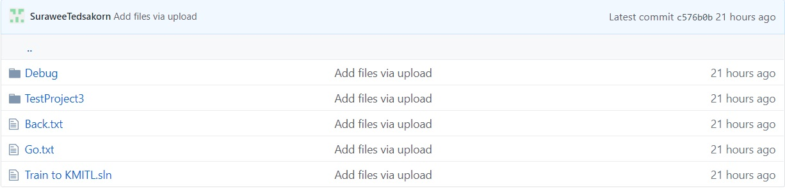
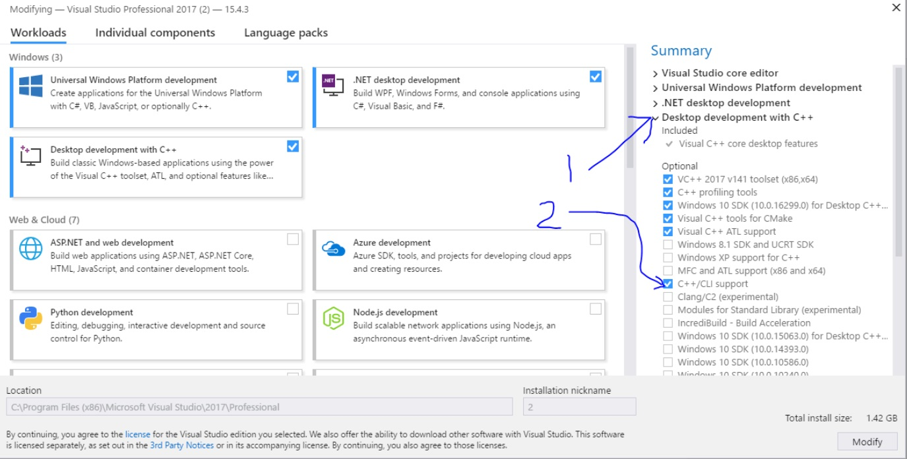
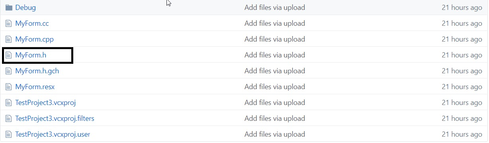
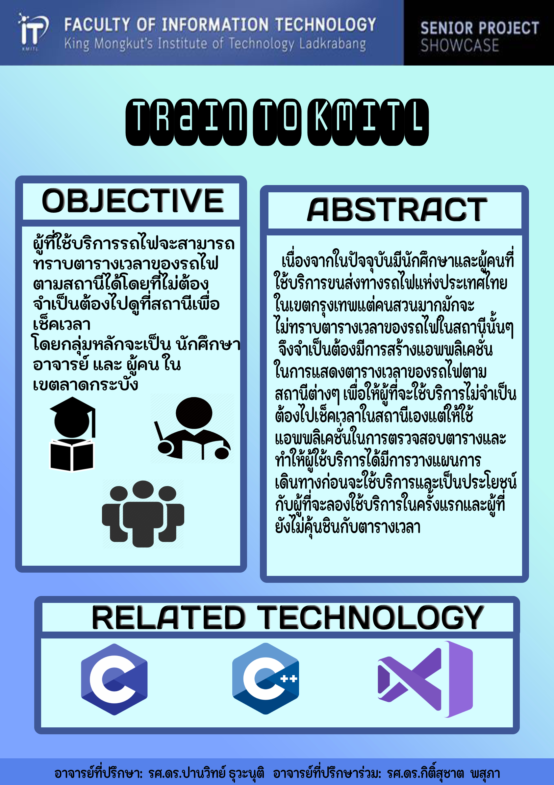

# What is this

คือแอปพลิเคชันที่ใช้เช็คตารางเวลาของรถไฟระหว่างสถานีคลองตัน ถึง หัวตะเข้

---

# How to openfile

การที่จะเปิดไฟล์นี้ได้นั้นจำเป็นต้องใช้โปรแกรม Visual studio และโหลดตัว CLR ถึงจะเปิดไฟล์นี้ได้

นี้คือในส่วนของตัว Code ที่เป็นภาษาซี โดยจะอยู่ใน Tain to KMITL -> TestProject3 -> MyForm.h

---

# How it works

---
# Poster

---
# Team Membars
๐ นายสุรวีร์ เทศกรณ์ - 61070252 
๐ นายณัทพงศ์ อักษราลิขิตสันติ - 61070056 
๐ นายนวภูมิ แก้วมณี - 61070102 
๐ นายสินสวัสดิ์ อภิชัยสมพล - 61070240 
